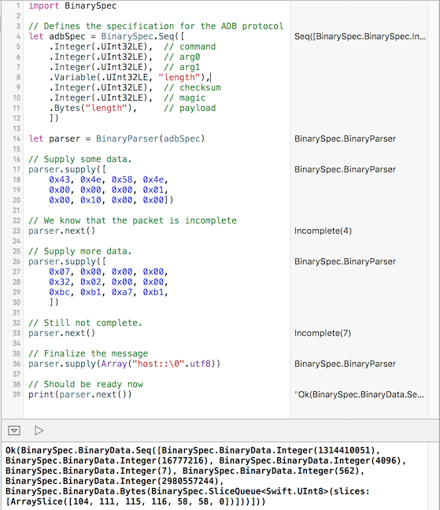

BinarySpec is an incremental, zero-copying parser for binary protocols
======================================================================

Installing
----------

### CocoaSeeds

BinarySpec currently only supports [CocoaSeeds](https://github.com/devxoul/CocoaSeeds).

    github 'antitypical/Result', '1.0.1', :files=>'Result/*.swift'
    github 'kennytm/BinarySpec.swift', '0.3.0', :files=>'Sources/*.{h,swift}'

License
-------

Apache 2.0.

